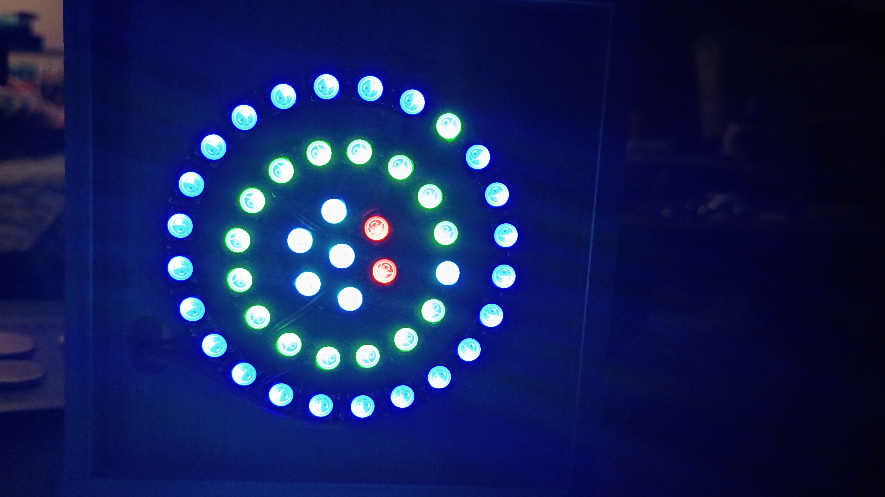
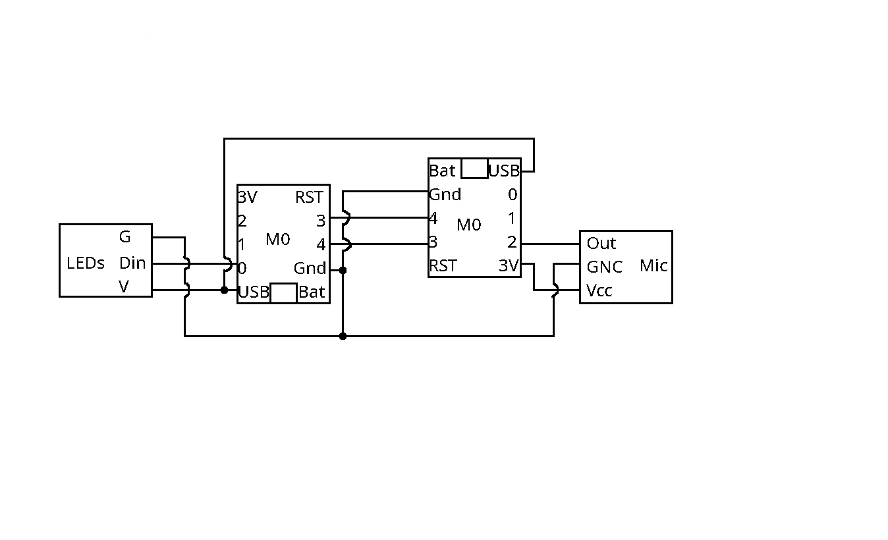
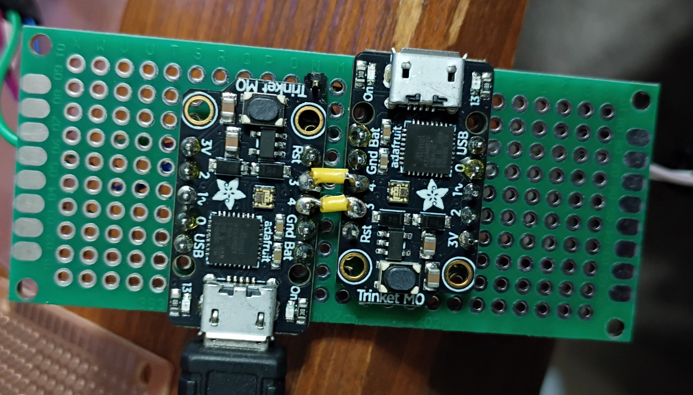
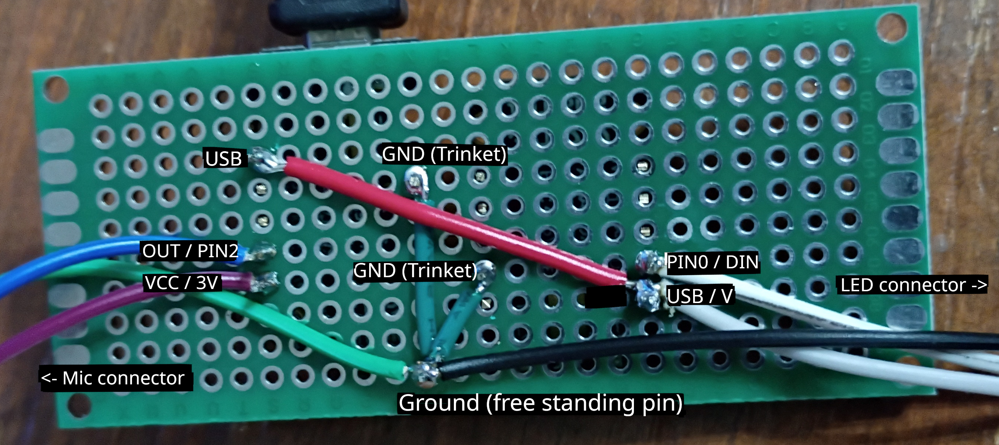

## Trinket Light Organ

This project is a sound reactive light organ. It listens to sound and attempts to separate out four frequency bands and use the loudness detected in those band to control PWD LEDs.

### Parts list
I found most of these at a microcenter. They seemed to have normal prices. Other sources seemed to have significantly higher prices especially for the Trinket (resellers). PWM LEDs prices vary widely, and theres a lot on the market. Recommended to get all the same type as mixing RGB with RGBW or even pebble with a regular neopixel might have mixed results as different values for color may be handled differently.

- [2x Trinket M0](https://www.microcenter.com/product/503915/adafruit-industries-trinket-m0-for-use-with-circuitpython-arduino-ide)
- [Electec Mic w/Adjustable Gain](https://www.microcenter.com/product/613641/adafruit-industries-electret-microphone-amplifier-max4466-with-adjustable-gain)

For the desktop sized ringed organ (as seen in action here https://www.youtube.com/watch?v=p-rRPTdcBIs). Make sure they are all RGB and not RGBW.

{width=300}

- [7 LED Jewel](https://www.microcenter.com/product/456218/NeoPixel_Jewel_-_7_x_WS2812_5050_RGB_LED_with_Integrated_Drivers)
- [16 LED Ring](https://www.microcenter.com/product/655358/adafruit-industries-neopixel-ring-16-x-5050-rgb-led-with-integrated-drivers)
- [24 LED Ring](https://www.microcenter.com/product/654831/adafruit-industries-neopixel-ring-24-x-5050-rgb-led-with-integrated-drivers)

The rings and jewel are expensive for the number of LEDs, so you might opt to get regular RGB LED strips that can be cut and connected via soldering, which also gives more flexibility for arranging them how you want. The pebble is very flexible as the LEDs are spaced further apart and the wires also coated. Seems good for sewing to fabric or stuff that needs to be able to move more freely.

- [Pebble LED 100 strand](https://www.microcenter.com/product/691526/adafruit-industries-neopixel-pebble-seed-led-strand-100-leds-4-pitch-10-meters-long)

Inland (microcenter's house brand) also has some inexpensive LED options, such as:

 - [LED Strip 5 Meter 60 LED Per Meter](https://www.microcenter.com/product/623854/inland-ws2812b-individually-addressable-led-strip-5-meter-60-led-per-meter)

There are many more options when it comes to RGB LEDs that can be used. Check to make sure they are PWM compatible for addressing though, as some RGB LEDs are not.

### Wiring

Its a good idea to get everything working before soldering it all together.

Grounds are connected together in a star configuration (see wiring photos below)

The USB pin is used to power the other trinket and LEDs when only one of the Trinkets has power coming in via the micro usb port. (Both trinkets can be connected via micro USB when writing the programs to them)

{width=750}

{width=600}

{width=600}

When soldering, it was useful to have a multimeter handy to check connections.

### Programs

Arduino IDE v1.8.19 was used for code editing and writing the programs to the microcontrollers. You may need to add an additional board manager url to get the Trinket M0 to selectable as a Board from the Tools menu item.

`https://adafruit.github.io/arduino-board-index/package_adafruit_index.json`

As per instructions in the m0_filter program, optimize for "Fastest"

Make sure debugging LED's and serial writes are disabled for better performance.

#### m0_filter

This program should be loaded on the board with the microphone. It is responsible for running the sound through four band pass filters and passing that information via serial to the other microcontroller. There are five `float`s near the top of the file that may be edited if you want to change the ranges of the bandpass filters.

#### lighting

This program should be loaded on the board connected to the LEDs. It is responsible for taking data read over serial from the filter controller and controlling light effects.

It also can be configured; two methods of lighting are present. The simplest lights up more lights from the start to the end of the range for each of the four filter ranges. Ie, a quiet low note will only illuminate a few of the LEDs on the low band (ie, red LEDs), whereas a really loud high note will light up a lot of the LEDs on the high band (ie puple).

The second method involves more planning but can be used for more interesting effects. This allows you to group numbered LEDs into groups for different levels of loudness for each filter range. It will require more planning and uses three arrays. An example of three rings using the mapping:  

### Other Links

[Original m0 filter](https://github.com/moggen/m0_filter)

Thanks to Magnus Öberg for this filter and having figured out how to use a trinket m0 for bandpass fitlering

[Tone Generator](https://onlinetonegenerator.com/)

Used this while testing the setup of the filter ranges and troubleshooting the coloring of LEDs for different levels.

[Trinket Circuit Diagram](https://learn.adafruit.com/assets/45723)

Used when trying to figure out why ADC reads were slowing down when connected to a battery vs USB port from a computer for power. Was interesting but didn't really find out why. Removing the code that reset the ADC pin seemed to fix the read speed.

[Pinouts](https://learn.adafruit.com/adafruit-trinket-m0-circuitpython-arduino/pinouts)

Good reference for the PINs and what they can be used for.

[Musical Notes](https://www.liutaiomottola.com/formulae/freqtab.htm)

Used this when trying to determine what would be good boundary fequencies for the different four bands.

[Arduino reference](https://docs.arduino.cc/language-reference/)

